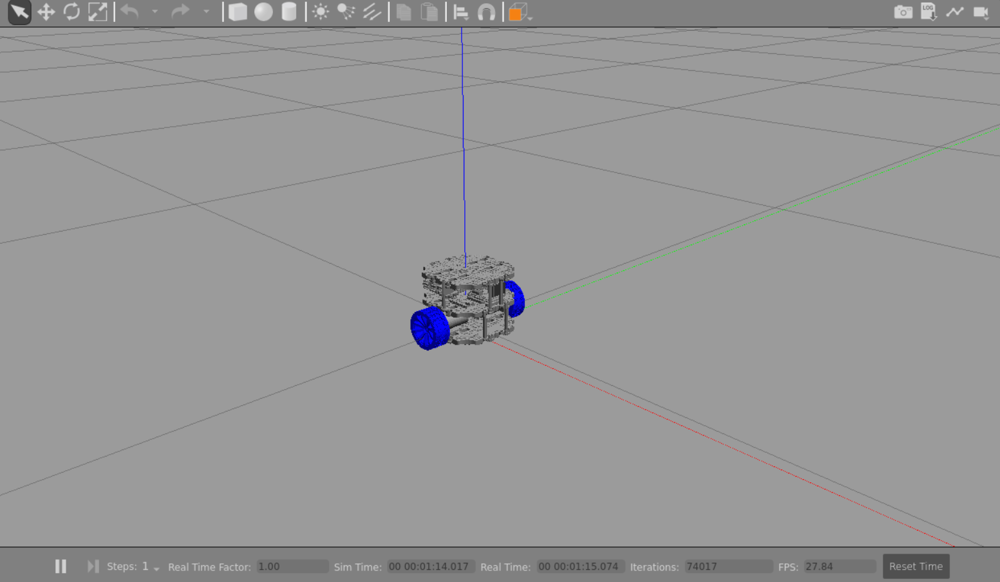
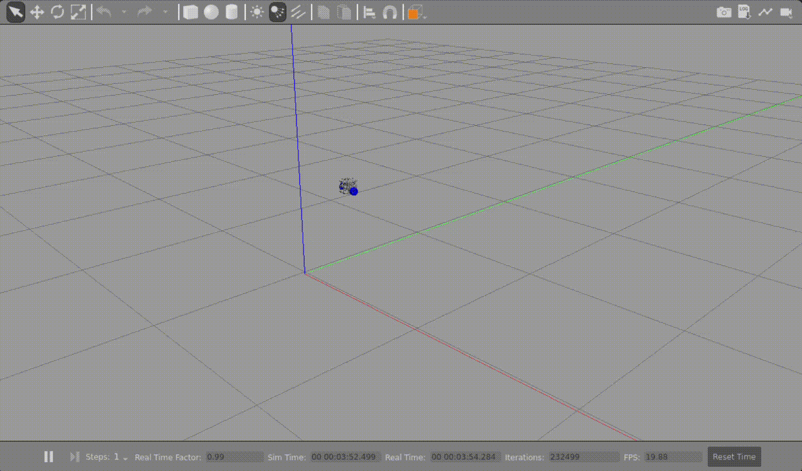
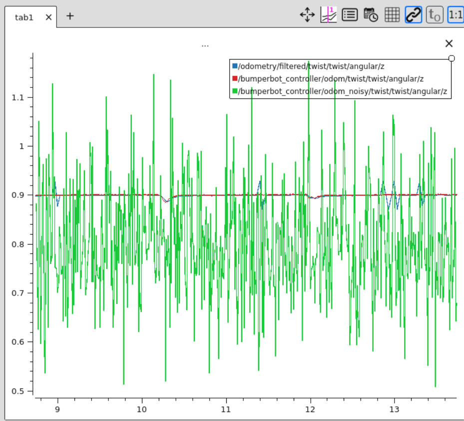
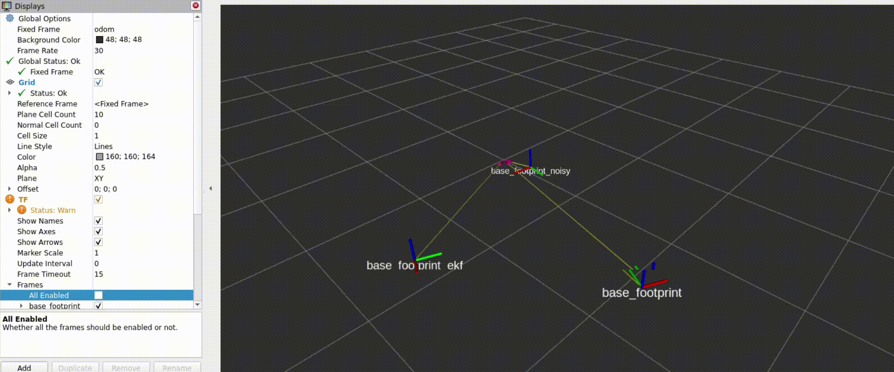

# Bumperbot Robot

## Overview
Bumperbot is a 3D differential drive robot simulated in Gazebo using ROS 2. It consists of multiple packages that enable simulation, control, and localization.





---

## Bumperbot Description
The `bumperbot_description` package provides the necessary URDF and launch files to spawn the robot in an empty Gazebo world.

### Launching the Robot
To launch the robot in an empty Gazebo world, run:

```bash
ros2 launch bumperbot_description gazebo.launch.py
```

### Sensors and Control
- The robot is equipped with an **IMU** for orientation sensing.
- Motion control is handled using `gazebo_ros2_control/GazeboSystem`.

---

## Bumperbot Controller
The `bumperbot_controller` package contains both **Python** and **C++** implementations for controlling the robot.

### Controller Types

#### **1. Forward and Inverse Differential Kinematics**
The kinematic equations describe the relationship between wheel velocities and robot motion.

- **Wheel Angular Velocity:**
  $$\phi_{left} = \frac{\Delta p_{left}}{\Delta t}, \quad \phi_{right} = \frac{\Delta p_{right}}{\Delta t}$$

- **Linear and Angular Velocities:**
  $$v = \frac{r \phi_{right} + r \phi_{left}}{2}, \quad \omega = \frac{r \phi_{right} - r \phi_{left}}{d}$$

- **Position Update:**
  $$\Delta s = \frac{r \Delta p_{right} + r \Delta p_{left}}{2}, $$
  $$\Delta \theta = \frac{r \Delta p_{right} - r \Delta p_{left}}{d}, $$
  $$x = x + \Delta s \cos(\theta), \quad y = y + \Delta s \sin(\theta)$$

Inverse kinematics can be used to compute the required wheel velocities given a desired linear and angular velocity:

$$\phi_{right} = \frac{2v + d\omega}{2r}, \quad \phi_{left} = \frac{2v - d\omega}{2r}$$

#### **2. Noisy Controller**
- Adds **Gaussian noise** to the wheel encoder readings:  
  $$p_{left} = p_{left} + \text{Noise}(0, 0.005), $$
  $$p_{right} = p_{right} + \text{Noise}(0, 0.005)$$

### Launching the Controller
Run the following command to launch the controller:

```bash
ros2 launch bumperbot_controller controller.launch.py use_python:=true use_simple_controller:=true
```

- Set `use_python:=false` to use the C++ version.
- Set `use_simple_controller:=false` to use the noisy controller.

---

## Bumperbot Localization
The `bumperbot_localization` package fuses **IMU** and **wheel encoder** data using **Kalman and Extended Kalman Filters** for better odometry estimation.

### Why Sensor Fusion?
- **Wheel encoders** alone are susceptible to **slippage and drift**.
- **IMU** provides orientation data but suffers from **gyroscopic drift**.
- Combining both using a **Kalman Filter (KF)** significantly improves localization accuracy.
- The **Extended Kalman Filter (EKF)** is used for nonlinear motion models.

### Kalman Filter Implementation
#### **1. Prediction Step**
- Predicts the next state based on control inputs:
  $$\hat{x} = x + u, \quad \hat{P} = P + Q$$

#### **2. Measurement Update**
- Updates state estimate based on new sensor readings:
  $$K = \frac{P}{P + R}$$
  $$x = \hat{x} + K(z - \hat{x}), \quad P = (1 - K)P$$

#### **3. Extended Kalman Filter (EKF)**
- Incorporates nonlinear motion models:
  $$x' = f(x, u) + w$$
  $$z = h(x') + v$$
  - Uses **Jacobian matrices** to linearize motion and observation models.
  
### IMU Republisher
- The `imu_republisher_node` repackages IMU data to align with `base_footprint_ekf`.
- Publishes to the `imu_ekf` topic.

### Launching Localization
Run the localization stack:

```bash
ros2 launch bumperbot_localization local_localization.launch.py
```

---

## Visualization
- **PlotJuggler for real-time data visualization:**

  

- **RViz comparison between odometry and base_footprint:**

  
